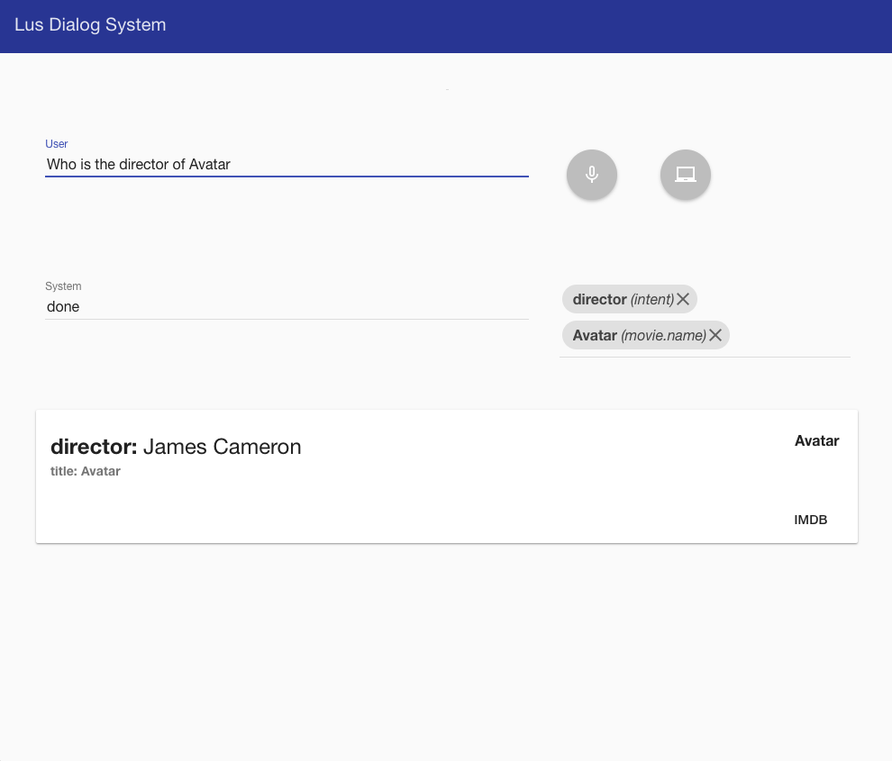

# Dialog System
> A dialog system for movie search, Eduard Caizer.



## The system
The system is divided into **app** *related to the server side* and **app_web** *related to the client side*.

```
├── app
│   ├── controller
│   │   ├── concept
│   │   ├── database
│   │   ├── init
│   │   ├── intent
│   │   └── partial
│   ├── lib
│   │   └── models
│   └── model
│       ├── classifier
│       ├── database
│       ├── dialogManager
│       ├── responseManager
│       ├── responseUtil
│       └── slu
└── app_web
    ├── components
    ├── controllers
    ├── css
    ├── icons
    ├── services
    └── templates
```
### Installing
The installation is easy, just clone the project into the *apache main root* directory of your server.

```
eg. 
$ cd /var/www/
$ git clone https://github.com/Rezyak/LUS-Project-2.git

```

## Running
Just open in the browser *127.0.0.1* or *127.0.0.1/index.html*.

Then there are 2 Fab-Buttons:
* the one with a microphone is used to speak with the system
* the other one is optional, it can be used to query the database *as an alternative to speech recognition*
* when the system recognizes something, it will appear a *chip*: it can be removed from the system memory

## Built With

* [PHP](php.net) - Server side
* [AngularJS](https://angularjs.org/) - The web framework used
* [AngularJS Material](https://material.angularjs.org/latest/) - The web design framework used

## Authors

* **Eduard Caizer** - *See also* - [Lus Proj 1](https://github.com/Rezyak/LUS-Project-1)
